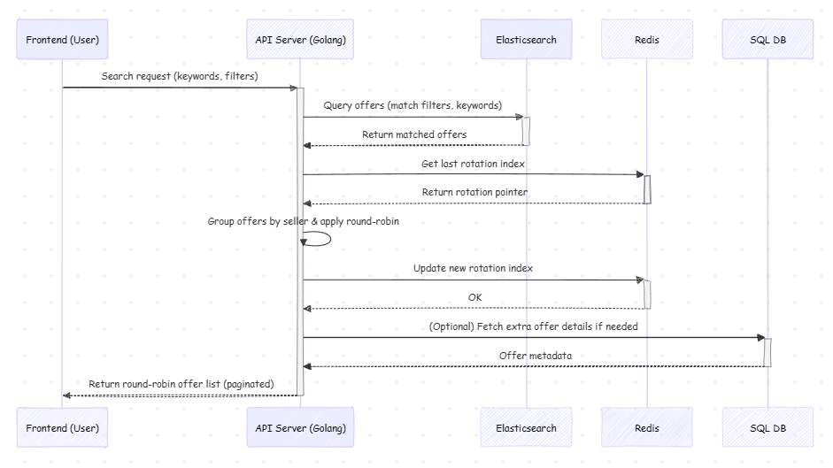
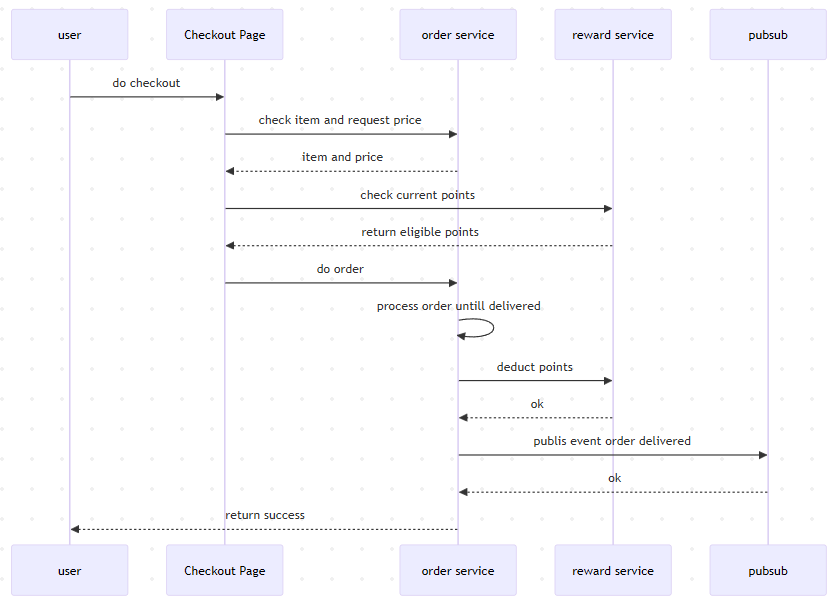
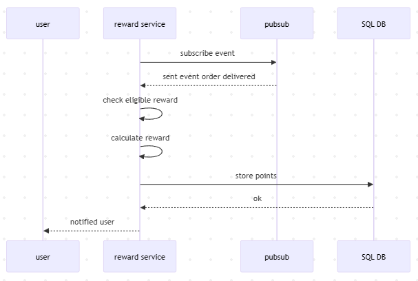

# 📝 G2G Test

## Question 1: Query SQL

**Question:** query to retrieve the User_ID of the user whose email
address contains some upper case characters

**Answer:** use function LOWER() to get the expected email and compare with the original email

```sql
SELECT User_ID FROM `user`
WHERE User_Email != LOWER(User_Email);
```

<br><br>
## Question 2: Round Robin Search System Design

## 1. System Design and Implementation

I considered 3 possible approaches:

### a. SQL-based Round Robin (using Window Function)
This approach uses SQL to rotate offers by seller directly in the query (e.g., via `ROW_NUMBER()` or `MOD()` logic).  
Its easy to build but not scalable once data grows large and queries become heavy.  
Also, it doesnt handle fairness properly because the order resets every time.
#### Example Query
```sql
WITH ranked_offers AS (
  SELECT
    o.*,
    ROW_NUMBER() OVER (PARTITION BY o.seller_id ORDER BY o.created_at DESC) AS rn
  FROM offers o
  WHERE o.is_active = TRUE
    AND o.category = 'mobile_legends'
)
SELECT *
FROM ranked_offers
ORDER BY rn, seller_id
LIMIT 50 OFFSET 0;
```

### b. Application Logic Round Robin (Stateless)
all offers are fetched and mixed at the application layer.  
Its more flexible than SQL but still stateless or the system doesnt remember which sellers already appeared.  
As a result, sellers with more offers tend to dominate.

### c. Elasticsearch + Redis (Stateful Round Robin) 
This is the chosen approach.  
Elasticsearch handles search and filtering efficiently, while Redis keeps the rotation state (which seller appeared last). and SQL as source of truth data. 
It scales well, ensures fairness across sellers, and maintains high performance even with millions of offers.

**Why this approach?**
- Scalable and fast for large datasets.  
- Keeps a fair exposure among sellers.  
- Easy to manage and monitor via Redis keys and Elasticsearch queries.


## 2. High-Level Architecture

### Flow Explanation

1. **Frontend** sends a search request with keyword and filters.  
2. **API** queries **Elasticsearch** for relevant offers.  
3. **API** retrieves the last rotation pointer from **Redis**.  
4. **Offers** are grouped by seller and mixed in **round-robin** order.  
5. **API** updates the rotation state in **Redis** for fairness in the next request.  
6. *(Optional)* Fetch additional data from **Database SQL** if needed.  
7. **Final paginated results** are sent back to the user.

## 3. Sample Database Schema

This section defines the database schema for the Offer System.

### 🗄️ SQL Tables

```sql
CREATE TABLE sellers (
  id SERIAL PRIMARY KEY,
  name VARCHAR(100)
);

CREATE TABLE offers (
  id SERIAL PRIMARY KEY,
  seller_id INT REFERENCES sellers(id),
  title VARCHAR(255),
  description TEXT,
  price DECIMAL(10,2),
  category VARCHAR(50),
  is_active BOOLEAN,
  created_at TIMESTAMP DEFAULT NOW()
);
```


## 4. Code snippets
```go
results := getElasticResults("mobile_legends")
adsBySeller := groupBySeller(results)

// Get last rotation index from Redis
idx := redis.Get("rr:seller_index").Int()

sellers := getSortedSellerIDs(adsBySeller)
rotated := append(sellers[idx:], sellers[:idx]...)

var mixed []Ad
for i := 0; ; i++ {
    added := false
    for _, s := range rotated {
        if len(adsBySeller[s]) > i {
            mixed = append(mixed, adsBySeller[s][i])
            added = true
        }
    }
    if !added {
        break
    }
}

// Update rotation pointer in Redis
next := (idx + 1) % len(sellers)
redis.Set("rr:seller_index", next)
```

<br><br>
## Question 3: Logic Code

**Question:** Given a list of strings, write a function to determine the minimum number of deletions
required for each string so that no two adjacent characters are the same

```go
func NumRemovedSameCharAdjacent(texts []string) []int {
	result := []int{}

	for _, text := range texts {
		removed := 0

		for i := 0; i < len(text)-1; i++ {
			if text[i] == text[i+1] {
				removed++
			}
		}

		result = append(result, removed)
	}

	return result
}
```


<br><br>
## Question 4: Reward Service System Design

## 1. Flowchart
Process checkout and order delivered

<br><br>
Process reward handling<br>


other than this, we must have job that run every night to deduct expired points

## 2. Database Schema